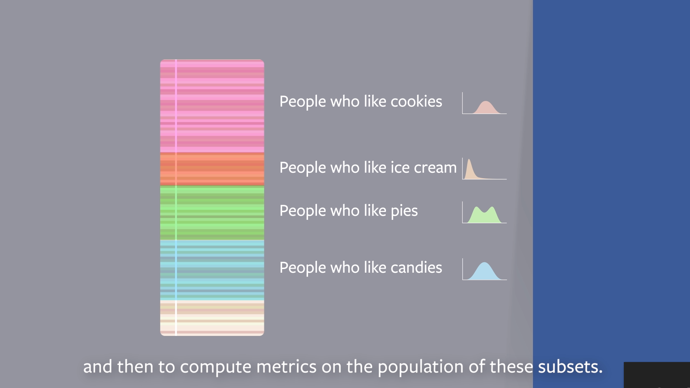

# Facebook Field Guide to Machine-Learning
So this is a guide to best real-world practices and provides practical tips about how to apply machine-learning capabilities to real-world problems.

If you are using machine learning to enhance your product in the real world, it’s important to understand how the entire development process works not just running the models.

The discussed below points are the concepts taught by Facebook ads machine learning team and will cover 6 major steps :

1. Problem definition
2. Data
3. Evaluation
4. Features
5. Model
6. Experimentation

### Problem Definition

To enter into real world and deal with problems ensuring proper implementation of business model as well requires not only knowledge of ML model or libraries. It also requires in depth analysis and research what exactly the problem is. We can not use a pre existing model for a new real world problem, we need to design a optimized solution for it.

Instead of having complex and expensive solutions and end frameworks one can easily provide simple options to like do ads are relevant or not and user can select by himself. And by this simple method we can use less complex ligression models.

Things to be taken care of:

1. Determine the right task for your project
2. Simple is better than complicated
3. Define your label and training example precisely
4. Don't prematurely optimize

### Understanding and Preparing Data
So basically preparing the training data is a core part of a machine learning project. It’s an active not passive part of machine learning research and is one of the most powerful variables to create high-quality machine learning systems

3 key areas to pay attention to :

1. Data recency and real time training
2. Training/Prediction consistency
3. Records and Sampling

So if the data is static then there is no problem but issue arises when there is dynamic data. Like some data points are collected on the frontend whereas many features are due to offline model pf application. Also data like uploading of pictures at different time from different place leads to very varying data. Also there is significant change in yearly data as data speeds, connections and likings are changing every day.

### Evaluation of Model's Performance

Before jumping into developing more features and iterating on model architectures, it’s important to have a clear plan for how to evaluate the performance of your model. 

#### Analysis of data

##### Offline vs Online Evaluation

#### Calibration of Model:

Basically Calibration is equal to (Sum of Predictions/Sum of Labels)

Our model should be well calibrated for both test and train set, this is so that the average prediction matches the average response rate.
> If model is under or over calibrated on test data, this means model doesn't generalise well to new data and is overfitting

### Dividing into smaller sets and then evaluating

## Features
It's important to select appropriate categorical, continuous and derived features and how to choose the right feature for the right model.
After data features is the most impactful for a ML model.
> Data has larger but slower iteration cycle
> Features has smaller but faster iteration cycle

##### Types of Features
1. Categorical
2. Continuous
3. Derived

## Model
To choose the right model for your data and find the algorithm to implement and train that model is equally important 
* How to pick a model
* How to tune a model
* How to compare models

#### Tuning Hyperparameters

#### We can also use Linear model for Non linear data 

